## I/O Model Capabilities

Prior to version 3.0.0, the Energy Policy Simulator (EPS) only calculated the direct (first-order) cash flow effects of the policy package: namely, which entities spent more or less money and which entities received more or less money, due to changes in prices or quantity of fuel, equipment, or labor purchased, or taxes and subsidies.  This allowed a user to get a sense of the direct "costs" or "savings" of a policy package, but it could not calculate outputs such as the change in GDP, jobs (employment), or employee compensation, as those metrics strongly depend on how the recipients of first-order cash flow changes use those dollars (or how they make up the shortfall if their cash flow is reduced).

In the 3.0.0 release, a macroeconomic input-output (I/O) model was added as a fully integrated component of the EPS.  The I/O model adds the capability to estimate a modeled policy package's impacts on:
- GDP (total, and value added disaggregated by industry)
- Jobs (total, and disaggregated by industry)
- Employee Compensation (total, average compensation per employee, disaggregated by industry, and disaggregated by union vs. non-union jobs)
- All of the outputs above can also be disaggregated by direct, indirect, and induced impacts.  These terms are explained below.

The EPS now captures how money is re-spent (by government, by households, and by each industry), capturing indirect and induced economic activity caused by the policy package.  New feedback loops from the I/O model into the main energy-demanding sectors (Transportation, Buildings, and Industry) now allow the EPS to calculate the energy use and emissions associated with indirect and induced economic activity.  Prior to 3.0.0, only direct changes in economic activity caused by the policy package were captured.

A new set of Government Revenue Accounting (GRA) levers allows the user to adjust the way in which government accounts for changes in its revenue (i.e. how it spends additional revenue, or how it makes up for drops in revenue).  There are five mechanisms government may use:
- changes in regular spending
- changes in deficit spending
- changes in household taxes (including climate dividend payments)
- changes in payroll taxes
- changes in corporate income taxes

The extent to which government employs each of these strategies can be customized, allowing for any combination of these modes.  Additionally, these levers can be set to different values for every tax and subsidy policy in the EPS, as well as how government accounts for changes in interest on the national debt, and how government accounts for other changes in its cash flows (e.g. not driven by tax or subsidy policies, such as government buying electricity instead of gas to heat government buildings if those buildings are electrified).

This powerful set of tools allows for simulation of complicated policy packages, such as a revenue-neutral carbon tax that is 50% rebated to households as a climate dividend and 50% used to offset payroll taxes, enacted alongside a subsidy for electric vehicles that is 75% funded through increased deficit spending and 25% funded through a reduction in spending on other government programs.

## Economic Categories and Data

The I/O model breaks the economy down into [International Standard Industrial Classification (ISIC) codes (Rev. 4)](https://unstats.un.org/unsd/publication/seriesM/seriesm_4rev4e.pdf), a classification system for economic activity developed and maintained by the United Nations Statistics Division.  Input-output tables specify which ISIC codes (e.g. industries) supply the inputs for each other industry, and which entities buy the outputs of each industry.  Other tables, also divided up by ISIC code, specify the total jobs, value added, employee compensation, and economic output of each ISIC code.  By default, the EPS draws these data from the OECD Statistical Database, where the OECD has freely released their [input-output data](https://stats.oecd.org/Index.aspx?DataSetCode=IOTSI4_2018) and [associated employment-related data](https://stats.oecd.org/Index.aspx?DataSetCode=TIM_2019_MAIN) for over 60 countries and regions.  For citations to specific tables within the OECD database, [download the EPS](download.html) and look at the first tab of the Excel file for the variable in which you are interested.  EPS adaptations for regions not in the OECD database will use other sources of I/O data, reformatted to fit the ISIC code categories used by the OECD.

The OECD's data uses 36 ISIC code categories, which is generally sufficient for the EPS.  However, the OECD lacks sufficient granularity for energy-supplying industries.  Therefore, the EPS maintains its pre-3.0 break-out of energy suppliers (electricity suppliers, coal suppliers, natural gas and petroleum suppliers, biomass and biofuel suppliers, and other energy suppliers), and calculates impacts for these energy-supplying industries.  Similarly, the EPS uses its more sophisticated [fuel import and fuel export calculations](fuels.html) to determine the cash flows associated with fuel imports and exports, instead of using the OECD data.  The more sophisticated handling of energy products and energy industries is the main reason that non-energy industries and energy industries are treated differently on each EPS sector's "Cash Flow" sheet in Vensim, as well as on the [Cross-Sector Totals](cross-sector-totals.html) sheet.

## Direct, Indirect, and Induced Economic Impacts

In this document, the effects of the policy package on key economic metrics (e.g. jobs, GDP, employee compensation) are sometimes described as "direct," "indirect," and "induced" impacts.  The EPS captures all three types of impacts.  It can be helpful to have an understanding of the differences between these types of impact.  Consider a hypothetical policy whose effect is to cause the auto manufacturing industry to grow (to increase its output).

- **Direct** economic impacts are those within the affected business itself, caused by the policy or project.  For example, if the policy causes the auto manufacturing industry to hire more workers, those added jobs are a direct impact of the policy.

- **Indirect** economic impacts are those within suppliers of the affected industry.  For example, if the growth of the auto industry causes the auto manufacturers to buy more steel, and steel-making companies hire more workers in response, the added jobs at steel-making companies are an indirect impact of the policy.

- **Induced** economic impacts are those caused by respending of money paid to workers or government as a result of the growth of the affected industry.  For example, the new workers at the auto- and steel-making companies will spend their wages on various items, such as restaurants and leisure travel.  The resulting job growth in the restaruant industry or in the leisure travel industry are an induced impact.  Similarly, if the growth of the auto industry increases government tax revenue (for instance, from workers' income taxes or sales taxes on the additional vehicles sold), and government spends the money on building new highways, added jobs at highway construction companies are an induced impact.

## Note on Policy Effects on Jobs When at Full Employment

As money can be respent with ever-increasing rapidity (more passes per time period), there is effectively no hard limit to how much policy may increase value added or employee compensation.  In contrast, the supply of workers is not infinite.  At times when there is non-trivial unemployment, it is fair to assume that policy effects to boost employment will draw unemployed people into the workforce (if not directly, then because the unemployed people can occupy positions vacated by workers who take the newly-created jobs).  Hence, in most situations, policy-driven job gains can be treated as additive to BAU jobs.

However, at times when the economy is at full employment (e.g. unemployment is extremely low, and the labor force participation rate is very high), jobs added by a policy may take workers from other businesses, who may in turn take workers from other businesses, etc., failing to draw more people into the workforce, due to the lack of non-employed people interested in and able to work.  Even in this situation, creating new jobs can be beneficial because it may increase overall job quality.  (If the new jobs were not more attractive than at least some existing jobs, no workers would switch to the new jobs.)  But the gain in total number of workers will be dampened.

The jobs calculations in the EPS assume the economy is not at full employment, so newly created jobs are additive.

## Credit for I/O Calculation Approach

The I/O model within the EPS follows generally-accepted I/O modeling principles pioneered by Nobel Prize-winning economist [Wassily Leontief](https://en.wikipedia.org/wiki/Wassily_Leontief) and refined by others.

We gratefully acknowledge the invaluable contributions of the [American Council for an Energy-Efficient Economy](https://www.aceee.org/) (ACEEE), [Jim Barrett](https://www.barretteconomics.com/), and [Skip Laitner](https://www.linkedin.com/in/skip-laitner-746b124/) for their guidance and advice in implementing the I/O model within the EPS, and for allowing us to learn from the [DEEPER I/O model](https://www.aceee.org/files/pdf/fact-sheet/DEEPER_Methodology.pdf), originally created by Skip Laitner.

## I/O Calculation Approach

A detailed, illustrated walkthrough of the calculation approach appears below.  Note that inputs to the I/O model pertaining to the direct impacts of the user's chosen policies come from the [Cross-Sector Totals sheet](cross-sector-totals.html), so if you have interest in how these inputs are obtained, you may wish to review that documentation page before proceeding. 

## Incorporating Macroeconomic Feedbacks

Government and households can respend any increase in cash they get due to the policy package (and, conversely, can reduce their spending if the policy package decreases their available cash).  Households will always change their spending, while government's response to changes in its cash flow is specified using Government Revenue Allocation (GRA) settings, discussed below.

The inputs to the I/O model already include direct changes in cash flow for government and households, such as when households spend less money on fuel and more money on vehicles due to fuel economy standards.  However, there are also indirect effects on household and on government cash flow caused by the policy package's effects on industry.  For example, if industrial output increases, industries may hire and pay more workers, which increases household cash flow.  Some of industries' increased output may go to corporate income taxes and payroll taxes, and some of the increased employee compensation will go to individual income taxes, so increases in industrial output also lead to increases in government cash flow.  To capture these indirect effects, we use a macroeconomic feedback loop.  Here, we incorporate the results of the macroeconomic feedback loop on government and on household (i.e. "labor and consumers") cash flow, combining these effects with the direct policy-driven changes in cash flow for government and households.  There is also a control setting that can be used to disable this feedback, which is primarily for model debugging purposes and should generally not be used by model users.

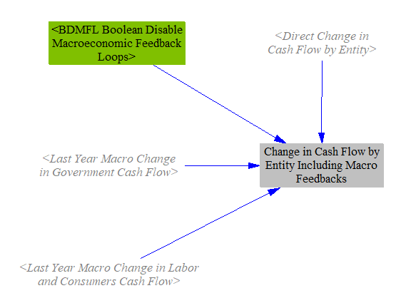

## Government Revenue Allocation Settings

One of the key inputs to the I/O model is the change in cash flow for each ISIC code and each tracked cash flow entity.  (There are nine cash flow entities: government, non-energy industries, labor and consumers, foreign entities, and the five energy suppliers listed above.)  These totals are calculated on the [Cross-Sector Totals sheet](cross-sector-totals.html), but they do not yet reflect the choices of how government will respend increases in revenues or make up for decreases in revenues.  This section of the model is where the user sets that behavior.

First, we obtain the change in government revenue due to each tax or subsidy policy in the EPS, as well as the change in interest paid on the national debt (which we calculate later in the IO model, explained below, and use with a one-timestep delay to avoid circularity errors).  We load these changes in cash flows into a single variable subscripted by `Govt Cash Flow Type`.  As of the EPS 3.0.0 release, the following government cash flow types are broken out:
- carbon tax revenue
- fuel tax revenue
- EV subsidy
- elec gen subsidy
- elec cap construction subsidy
- distributed solar subsidy
- fuel subsidy
- national debt interest
- remainder (all other changes in government cash flow, summed)

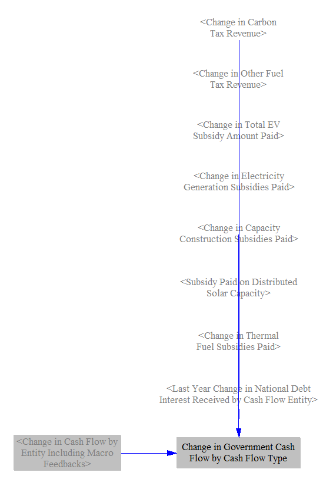

Government revenue allocation (GRA) settings are set as integer weights, from zero to 10, for each government cash flow type, for each of the five GRA mechanisms (listed in the "I/O Model Capabilities" section above).  They are set this way, rather than as percentages, so that if a user adjusts a single GRA lever, we are always able to calculate shares that add to 100% without adjusting the values of the other GRA levers for that cash flow type.

For each government cash flow type, we take the proportionate weights given to each of the five mechanisms, load them into a subscripted variable, and convert them to a percentage of each cash flow that is being handled by each mechanism.

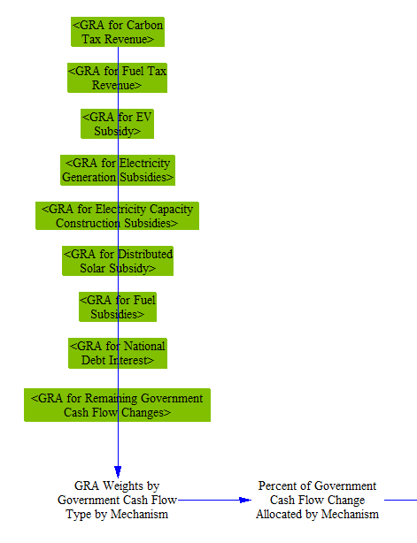

Next, we multiply each government cash flow type by the percentage assignments to different GRA mechanisms to divide up how government is accounting for that change in revenue.  We sum across policies, so we get the total change in revenue that needs to be handled under each of the five mechanisms.

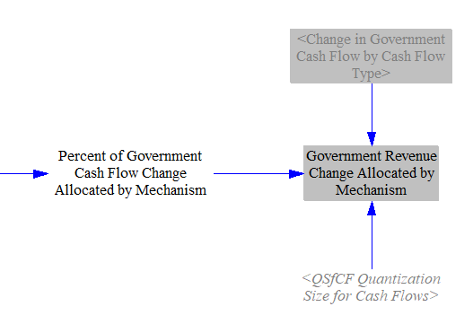

## Deficit Spending and National Debt Interest

Changes in deficit spending affect the government's budget deficit.  (If the government budget has a surplus, then these spending changes reduce or increase that surplus, but the terminology used in the EPS refers to a budget deficit.)  Changes to the budget deficit are cumulated across each year of the model run to find the cumulative change in the national debt (or surplus) as of each modeled year.  (As with other stock variables in the EPS, Vensim doesn't add inflows to the stock total until the following year, so we must separately add the current year's change in budget deficit to the stock variable to get the current year's cumulative change in the national debt.)

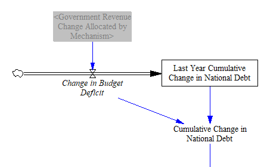

We use an interest rate taken from input data to calculate the change in the amount of interest the government pays on the national debt in each year.  (If the modeled region has a surplus, this is the inverse of the change in interest earned on the surplus.)

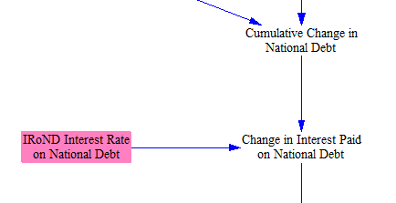

We allocate the change in interest paid on the national debt to cash flow entities based on what share of government debt they hold.  The only cash flow entities that can be holders of national debt are "non-energy industries," "labor and consumers," and "foreign entities."  These cash flow assignmnets are delayed by one year to avoid circularity, then added to the total changes in cash flows for each entity on the [Cross-Sector Totals](cross-sector-totals.html) sheet.  Assignment of the non-energy industries' share to ISIC codes is also handled on that sheet.

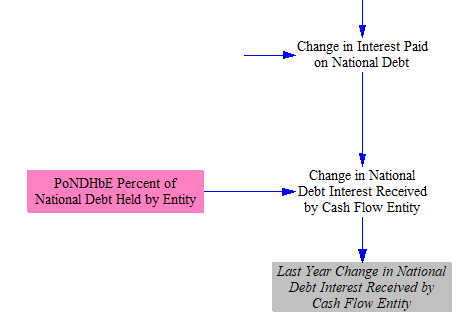

## Calculating Change in Domestic Output by ISIC Code

### Government and Household Spending Contribution to Change in Industrial Output

As the next step, we calculate the policy-driven change in output for each cash flow entity and each ISIC code tracked in the EPS.  The variable `Government Revenue Change Allocated by Mechanism` contains the change in government cash flow broken down into the five GRA mechanisms, and these pieces are assigned to different entities accordingly.

Note that government and household contribution to the change in industrial output is based on the change in money available for government and households to spend - i.e. change in cash flow, not change in revenue.  (Some of the change in revenue has already been spent on products and is already included in the change in industry revenue, so we need to use the change in cash flow for government and households to avoid double-counting.)  In contrast, industry contribution will be handled using change in revenue, not change in cash flow (discussed below).

First, we calculate the impact of changes in regular government spending, which is used to account for the change in government cash flow that was assigned to regular spending via the GRA levers.  We assume these changes in cash flow increase or decrease spending on ISIC codes in proportion to how the existing government budget is spent, as defined in variable `GEbIC Government Expenditures by ISIC Code`.

Change in households' cash flow are allocated to ISIC codes in the same proportions as existing household expenditures.  The change in households' cash flow includes any cash received from the GRA "household taxes" mechanism, which includes increases and decreases in individual income taxes, as well as climate dividend payments (if any).

### Industry Contribution to Change in Industrial Output

The contribution of changes in government and household spending to industrial output was calculated based on the change in cash flow (e.g. change in revenues minus change in expenditures) for government and for households, as discussed above.  This is the money they have available to respend.  The industry contribution is calculated based on policies' impacts on industry revenue, not industry cash flow.  This is because industry's output is generally the same as its revenue, and even if it does not change its net income (because the change in expenditures on things such as input materials, wages, and taxes equals the change in revenues), industrial output has nonetheless increased, as industry is producing more/fewer goods, paying more/fewer workers and taxes, etc.  (An adjustment to job requirements and employee compensation requirements per unit output, to account for changes in pass-through costs such as sales taxes, is discussed below.)

To start calculating the industry contribution to change in output, we sum the changes in government revenue that were transferred to industry via the GRA levers.  Changes in payroll taxes are allocated to ISIC codes in proportion to each ISIC code's total employee compensation, while changes in corporate income taxes are allocated to ISIC codes in proportion to each ISIC code's total value added.

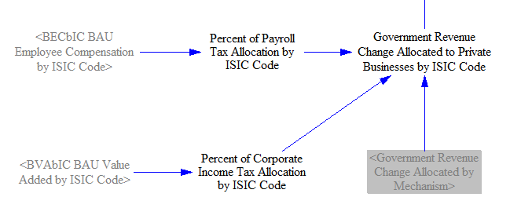

Policy-driven changes in industries' revenues have already been assigned to ISIC codes in the various sectors elsewhere in the EPS and summed on the [Cross-Sector Totals](cross-sector-totals.html) sheet.  Here, we do these things:
- We add in any change in government cash flow that was reallocated to ISIC codes using the GRA settings.
- We assign changes in cash flow for the five energy suppliers to the (more aggregated) ISIC codes for energy.  This is because we are about to use these data in the I/O model, which contains data for all ISIC codes but not for the energy supplying industries that we track separately.  (Direct cash flow impacts on the waste management industry are grouped with certain energy industries in one ISIC code category.)  We use weighted average output of different energy ISIC codes to help us assign cash flow impacts on broken-out energy suppliers to more aggregated energy ISIC codes.

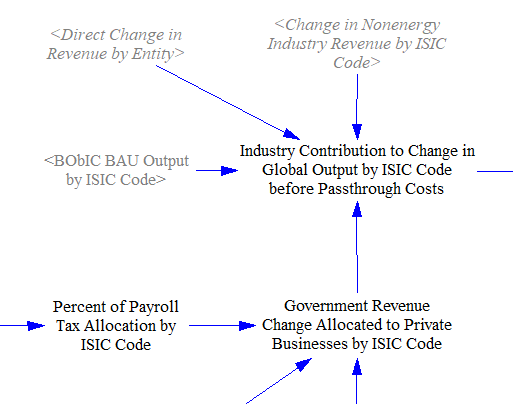

Expenses passed through to buyers (such as raising the price of a good by the amount of a tax levied on that good) don't increase output for employment (or employee compensation) purposes.  An industry doesn't need more workers because it is not making more products.  Therefore, we remove industry's revenue from passthrough costs from industry's contribution to output.  (For calculation of value added, we will add the passthrough costs back in later, because taxes and employee compensation paid are a part of value added and contribute to GDP.)  For more on how passthrough costs are calculated, see the [industry - cash flow](industry-ag-cash.html) documentation page.

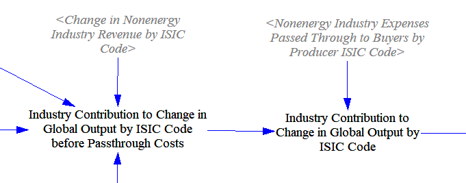

Next, we remove the "foreign content share" (the fraction of the spending on each ISIC code that is supplied by foreign entities - i.e. imports) from the total.  This restricts the changes in output to those affecting domestic suppliers in each ISIC code, which helps us calculate the effects of the policies on domestic (rather than domestic + foreign) jobs, GDP, and employee compensation.

(The import/export code on the [Fuels](fuels.html) sheet is not a replacement for doing this for the fuel industries.  The fuel trade code adds revenue for fuel exports and adds expenditures for fuel imports, but we use revenues here (not cash flows), so the revenues used here still include any changes in payments to foreign fuel suppliers.  Therefore, no exception is made for fuel industries here.)

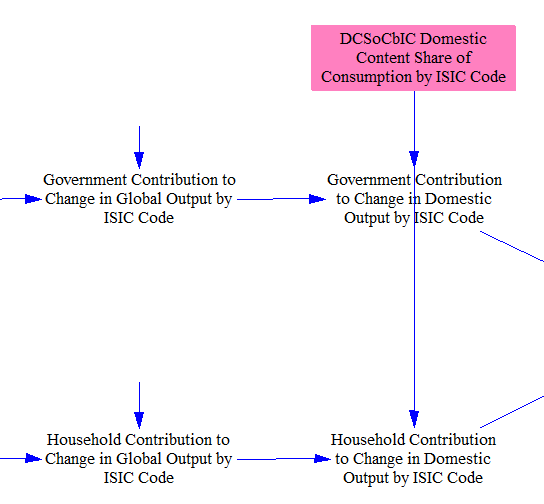

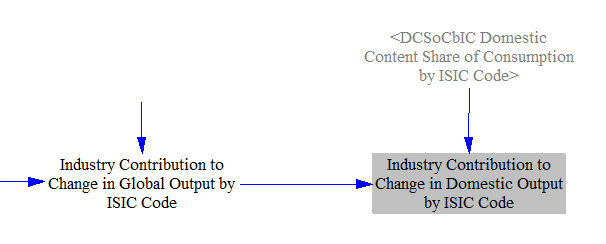

Finally, we sum the government and household contributions to change in output by ISIC code, because respending of these dollars will cause induced impacts on jobs, GDP, and employee compensation.  Changes in industry contributions to change in output by ISIC code are kept separate from this total, because those changes in output produce direct and indirect effcts, not induced effects, and we wish to keep the effects separate because they are handled differently in macroeconomic feedback loops and so that they may be reported individually in output graphs.

Changes in the cash flow assigned to "foreign entities" due to the policy package are assumed not to influence the extent to which foreign entities buy goods or services from the modeled region, as (1) these changes in cash flow are divided up among many foreign countries/regions and are likely to be very small next to the total size of the economies of these regions, and (2) foreign economies are likely to spend the vast majority of their cash on their own domestically-produced goods and services, and on imports from countries other than the modeled country.

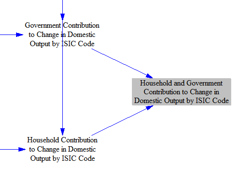

## Calculating Jobs, Value Added and Compensation Requirements per Unit Output

We begin by taking in data on total output, jobs (employment), value added, and employee compensation for each ISIC code.  These data are freely available for over 60 countries and regions from OECD databases, described in the "Economic Categories and Data" section above.

Some details about these three metrics:

- Jobs includes all employed people working within an ISIC code, including self-employed people, such as sole proprietors.

- Value added is a metric of the amount of additional value an industry contributes to its outputs, relative to what it paid for its inputs.  For example, if a company purchases raw steel for $10 and sells an item made of steel for $15, the value added is $5.  Value added funds business operations unrelated to purchasing inputs, such as a business paying its own workers, paying taxes it owes, investing in expanding the business, and producing profit for the business owners.  The value of the inputs was already captured in the "upstream" industry that produced those inputs (and industries still farther upstream - for instance, a maker of raw steel may purchase iron ore as an input).  Value added, summed across the entire economy, is one way to calculate GDP without double-counting.  (Summing the output of all industries would obtain a result that is too high due to a large amount of double-counting.)

- Employee compensation includes not just salary, but also bonuses, employer-paid benefits, employer contributions to retirement plans, etc.

We divide each of the three key metrics (jobs, value added, and employee compensation) by output to obtain "within industry" jobs, value added, or employee compensation per unit of output that ISIC code generates.  This provides a measure of direct (first-order) job intensity, value added intensity, and employee compensation intensity of each ISIC code.  These intensity or "Direct Requirements" variables will be used later to help us calculate the direct impacts of the policy package.

Just below on the IO Model sheet, we calculate "Direct Plus Indirect Requirements" variables.  These requirements variables are used to assist in the calculation of induced impacts (because induced impacts are not typically reported broken into direct and indirect components - that is, how much of the induced activity was induced by direct spending and how much was induced by indirect spending).  To do this, we must conver these direct ("within-industry") intensities into final intensities that include direct and indirect requirements.  Each "within industry" intensity is multiplied by the Domestic Leontief Inverse Matrix (DLIM) for the modeled region.  DLIM is obtained from the same OECD database as other I/O data, described above, and can be caluclated from a standard input-output table (using the procedure described on the "About" tab of the io-model/DLIM Excel file).  However, we do not need to calculate our own DLIM table, since it was available pre-calculated by the OECD.

In order to understand this step, it is crucial to understand what a Leontief Reverse Matrix is.  A screenshot of the upper left portion of the OECD's DLIM file for the United States (showing the first six ISIC code categories) appears below.  Please refer to it while reading the following explanation.

A Leontief Inverse Matrix provides a set of multipliers that illustrate how spending by each ISIC code in the economy affects each other ISIC code, as well as how it affects itself, after all respending effects are accounted for.  (Recall that each ISIC code contains many businesses, which may produce different products, so long as those products fall within the same ISIC code.)  The same industries appear in the rows and the columns (i.e. the matrix is square).

If a policy intervention increases (or decreases) the jobs, value added, or employee compensation of an ISIC code in a row by 1 unit, the resulting effect on all industries is shown in each column of that row.  The initial 1 unit is included for the industry in the current row, and then indirect effects account for the values in all other columns, as well as the amount exceeding 1 in that industry's own column.

For example, the "Agricluture" row in the table above has a 1.18 value in the "Agriculture" column (cell C9).  This means that if policies directly generate 100 jobs in agriculture, the ultimate effect will be to generate 118 agricultural jobs, because 18 more jobs are needed to supply the inputs for the 100 new agricultural jobs (such as growing feed crops for animals).  In the "Agriculture" row, the "Mining and extraction of energy producing products" column (cell D9) has an extremely low value (0.001) because the mining industry does not buy agricultural products, so inputs from agriculture are not needed for the mining industry to generate value.  In contrast, the column for the "Food products, beverages, and tobacco" industry (cell G9) has a value of 0.288, which is a very high multiplier.  This is because the agriculture industry is a very important supplier to the food, beverage, and tobacco industry, so growth of agriculture tends to accompany growth in the food and beverage industry.

If you read down a column, you see the amount of input from the industry in each row needed to produce 1 unit of value for the industry in the column.  For example, in the row for "Mining and extraction of energy producing products," the column for "Agriculture" (cell C10) has a value of 0.02, which is 20 times higher than the value in the agriculture row for the mining industry (cell D9).  This is because energy is an input to agriculture, so roughly 2 energy extraction jobs are needed to supply every 100 agriculture jobs.

If you multiply a one-dimentional "demand matrix" (a vector) of values by the Leontief Inverse Matrix, you obtain the amount of output from each industry required to meet that demand.  For example, if there is an external demand for $1000 worth of value from every industry, the DLIM multiplied by a vector with $1000 for each industry would provide the change in output produced by each industry to meet that demand.  The change in external demand (output) can be the result of a policy package, as calculated earlier.

That would be the classical way to use DLIM for output analysis.  However, we don't want to multiply the DLIM by quantities of output change directly.  This is because we aren't interested in the final change in _output_ of each industry.  We want to know the final change in _jobs_, _value added_, and _employee compensation_ for each industry.  (The difference between output and value added was explained above.)  Therefore, we must convert the multipliers obtained from the DLIM for output to produce results for jobs, value added and industry.  Therefore, we multiply by the within-industry jobs, value added, and employee compensation intensities to obtain a trio of DLIM-like variables that convert changes in output to changes in jobs, value added, and employee compensation, rather than remaining in units of output.  This trio is called the "Requirements" variables, as they specify the number of jobs, value added, or employee compensation that was "required" (i.e. created) to bring about a known change in output.

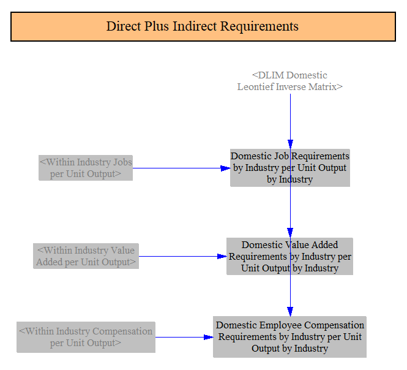

To calculate "indirect" effects on jobs, GDP, and employee compensation, we need versions of the requirements variables that exclude direct impacts.  To obtain this, we calculate an alternate version of the Domestic Leontief Inverse Matrix (DLIM).  We subtract the identity matrix (a matrix containing 1s along the diagonal, for matching ISIC codes, and 0s elsewhere) from DLIM to remove the initial output unit (job or currency unit) assigned to an ISIC code.  This leaves only the multipliers across all ISIC codes that reflect the indirect activity from adding a unit of output to a given ISIC code.

We then multiply the within-industry intensities by our modified DLIM to obtain requirements variables that include only indirect effects.

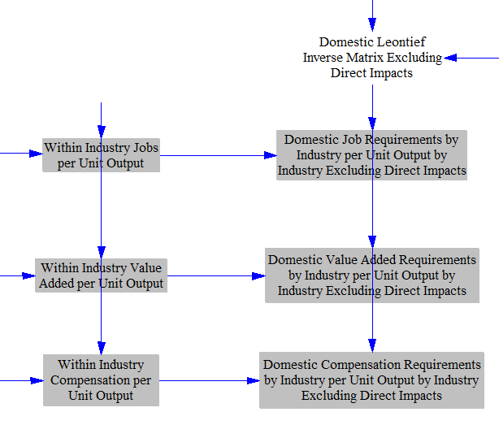

## Calculating Change in GDP, Jobs, and Employee Compensation

Now that we have constructed our trios of DLIM-like "requirements" variables, we can multiply the policy-driven changes in output by ISIC code (vector variables calculated earlier) by each requirements variable, to obtain the number of jobs, amount of value added, and amount of employee compensation that the policy package brought about in the course of creating the known change in output for each ISIC code.

We do this separately for direct, indirect, and induced impacts, so we may report them in these categories in our final output.  Direct impacts utilize only industry contribution to change in output (e.g. direct effects of policies on industry from the various sectors, plus any changes in taxes paid by industry due to GRA levers).  These changes in output are multiplied by the direct (e.g. within-industry) requirements varaibles.

When calculating value added, we add industry's added revenue from passthrough expenses back into the industry contribution (which was removed earlier), because this revenue does contribute to value added (but not to employment or employee compensation), as discussed above.

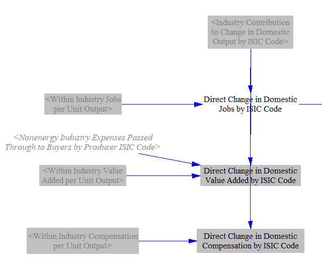

Indirect impacts also utilize industry contribution to change in output, as we are looking for the effects on the industries that supply the directly-impacted industries.  But indirect impacts use the special versions of the requirements variables calulated earlier (with a modified DLIM) that exclude direct effects.

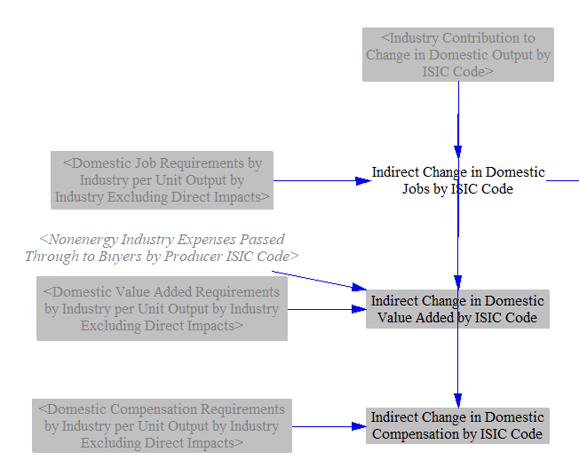

Induced impact utilize the contribution to output caused by changes in household spending and regular government spending (i.e. on ordinary government budget, not specifically targeted at any industry as part of a policy).  These are multiplied by the version of the requirements variables that include both direct and indirect effects, since induced impacts are traditionally not broken out into direct and indirect components.

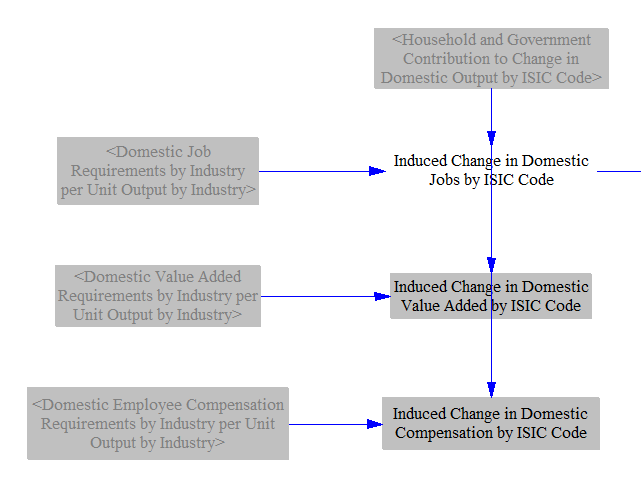

The EPS works in inflation-adjusted currency units.  That's fine for calculating value added and employee compensation, as these are amounts of money.  However, jobs have been converted from money using the "within industry" job intensities per unit output, which are based on a single historical year from our I/O input data.  In reality, labor productivity tends to increase over time, so more currency units of value can be generated by fewer workers.  Therefore, predictions of future jobs that are derived from output (in currency units) need to be discounted by the anticipated productivity gains through that year.  We take in an input variable containing anticipated annual productivity gains by ISIC code for future years and discount job creation (or losses) by these values.  (We also apply a quantization factor at this stage, to ensure our outputs are an even multiple of 1 job.)  We make this adjustment for direct, indirect, and induced job impacts, but the model structure is essentially identical, so only the version for direct imapcts is pictured here:

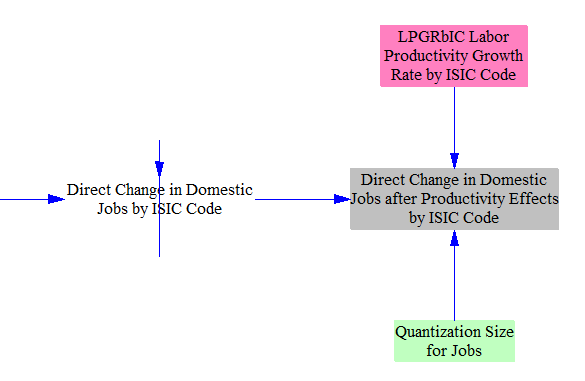

Finally, we sum the direct, indirect, and induced impacts to find the total impacts of the policy package on jobs, value added, and GDP.

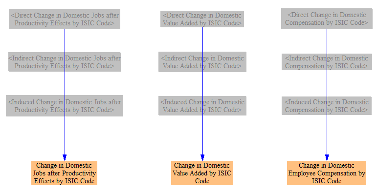

We now have our final predicted changes in jobs, value added, and employee compensation.  (A change in value added is the same as a change in GDP, since the sum of value added across all entities in society equals GDP.)  However, to calculate absolute values of these metrics in the policy case, we have to account for growth of jobs, GDP, and employee compensation in the BAU case, which is discussed below.

## Obtaining Time-Series Values for Jobs, GDP, and Employee Compensation

The approach above allows us to calculate time-series data for the effects of the policy package on jobs, GDP, and employee compensation.  However, our BAU data for total quantity of jobs, GDP, and employee compensation is based on a static, historical year from the I/O input data.  (No public, projected future time-series data for jobs, value added, employee compensation, and output, all disaggregated by ISIC code, are available, as far as we are aware.)  We generally don't need time-series BAU quantities if we are only interested in showing policy impacts (in absolute numbers of currency units or jobs) in output graphs, without macroeconomic demand feedbacks.  However, we do need BAU quantities to obtain certain values, specifically:

- Percentage change in contribution to GDP by ISIC code, used in [macroeconomic energy service demand feedbacks](macro-feedbacks.html)

- Percentage change in GDP (as opposed to change in absolute dollars)

- Change in compensation per employee (the absolute changes in number of employees and amount of compensation paid isn't sufficient to find the change in average compensation per employee)

- Energy use or emissions outputs in units of intensity per unit GDP

Therefore, we must calculate our own time-series BAU values of all three key metrics.

The calculation structure we use is identical for each of the three metrics (jobs, GDP, and employee compensation), so we will only walk through one of them here.  The other two are obtained the same way (except there is no need to calculate a non-disaggregated version of policy case total jobs or EE compensation).  We will use GDP as our example.

First, we take in a future projected BAU GDP time series that is not divided up by ISIC code (e.g. we don't know each ISIC code's contribution to GDP in the BAU case).  We add the policy-driven change in GDP (summed across ISIC codes) to find the policy case GDP.

We also apportion the time-series BAU GDP using the (static) BAU value added by ISIC code data, to obtain an estimate of future GDP apportioned by ISIC code.  This is the main variable that would be improved if time-series value added data disaggregated by ISIC code were available.

Finally, we add the policy-driven changes to value added by ISIC code to the BAU value added by ISIC code to find GDP, apportioned by ISIC code, in the policy case.

## Percent Changes in GDP

We calculate the policy-driven percentage change in GDP in two ways.

First, we divide up the total percentage points of change in GDP by the ISIC codes contributing to it.  This allows us to preserve the magnitude of our total change in GDP, express it as a percentage change, and apportion that percentage change to the ISIC codes that contributed to it.  The resulting output graph is extremely similar to the "change in GDP" output graph, but with the units of percentage points rather than currency units.  This helps to put GDP changes in context, since a model user may not intuitively know how large the projected future-year GDP for the modeled region is.

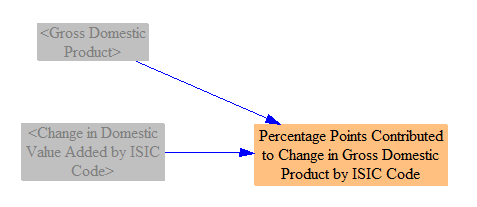

Second, we calculate the percentage change in the absolute size of each ISIC code's contribution to GDP.  This is a good metric for the policy-driven percent growth or shrinkage of each ISIC code.  It cannot be summed across ISIC codes to obtain overall percent change in GDP because ISIC codes have varying sizes.

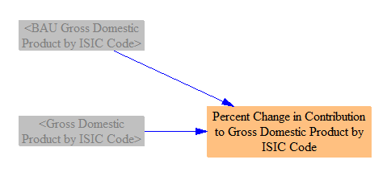

## Outputs in Intensity per Unit GDP

Some countries or regions set emissions or energy use goals in terms of intensity per unit GDP rather than establishing absolute energy use or emissions targets.  We calculate three X-per-unit-GDP metrics, so we can calculate and graph performance of the policy package against these metrics.

We simply divide each of: total CO2e emissions, energy-related CO2 emissions, and total primary energy use by GDP.

## Compensation per Employee

Using the time-series values for number of jobs and for compensation by ISIC code calculated above, we calculate the change in average compensation by employee two ways: separately by ISIC code, and overall across the economy.

Calculating change in compensation per employee separately by ISIC code illustrates how policies change the compensation of the average employee within a particular ISIC code, but it fails to capture whether more or fewer workers are within that ISIC code (e.g. it fails to capture workers shifting between ISIC codes, such as workers in a low-paid industry getting jobs in a higher-paying industry, or vice versa).  Therefore, it is not a good metric of a policy package's overall benefits (or drawbacks) in terms of employee compensation.

Calculating average change in employee compensation for all workers, without disaggregating by ISIC code, is the better metric of how a policy affects overall employee welfare, since it captures both changes in payments within each ISIC code, as well as movement of workers between ISIC codes.

The policy case and BAU case values are calculated using the same methodology, so only policy case values will be shown here.

First, we divide total employee compensation (by ISIC code) by the number of employees (by ISIC code) to obtain average employee compensation by ISIC code.

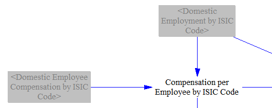

We weight the average compensation per employee in each ISIC code by the number of employees in that ISIC code to obtain a weighted average compensation per employee across the economy.

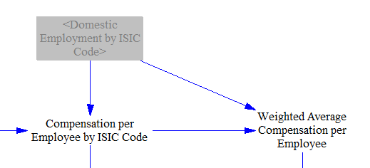

We calculate the BAU equivalents of these values, and then we take the difference between the BAU and Policy cases to obtain the change caused by the policy package.

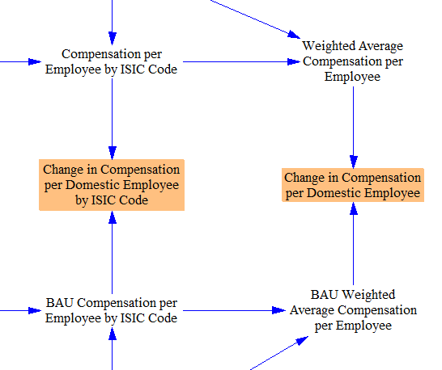

## Union Representation

To calculate the change in union-represented jobs and non-union-represented jobs, we take in input data for the percentage of jobs within each ISIC code that are represented by unions.  (We currently use time-invariant union representation shares using the latest available data, though using future projected time series data may be possible in a future EPS release, if reliable projections of future changes in union representation share by ISIC code are available.)  We multiply the new jobs in each ISIC code by that ISIC code's union representation share to find the total change in union-represented jobs.  The remainder are non-union-represented jobs.

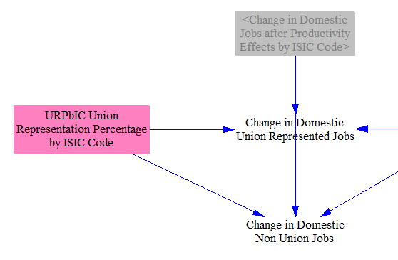

## Macroeconomic Feedbacks

The results of the IO model are also used in macroeconomic feedback loops, discussed on the [Macroeconomic Feedbacks](macro-feedbacks.html) documentation page.